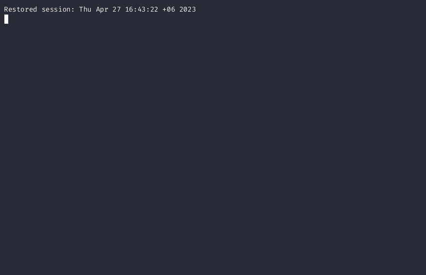

  [](https://github.com/KhanShaheb34/Coterm/releases/latest) [](https://crates.io/crates/coterm) 

# Installation

## Automated installation:

```bash
curl -s https://coterm.vercel.app/install.sh | bash
```

This will install the latest version of Coterm and add `ct` alias for you.
If it does not support your platform, please check out [Build from source](#build-from-source) section.

Note that this script will install Coterm in `/usr/local/bin` directory.
It might ask for your password to do so.

> Running a script from the internet is not a good idea. Please check the script before running it.

## Using Cargo

```bash
cargo install coterm
```

You need to have Rust and Cargo installed to use this method. See [here](https://www.rust-lang.org/tools/install) for more information.
And this installation does not add `ct` alias for you. You need to add it manually.

## Build from source

- Install Rust and Cargo from [here](https://www.rust-lang.org/tools/install).
- Clone the repository and `cd` into it.
- Run `cargo build --release` to build the binary.
- Copy the binary from `target/release/coterm` to your `PATH`.

# Usage

```bash
ct [PROMPT]
```

For example if you want a list of all typescript files:

```bash
ct list ts files
```

And after the tool generates a command you can add revisions to it, for example:

- ignore node modules
- sort by size
- etc.

## Show Help

Check out the help page for more information:

```bash
ct -h | --help
```

# Examples



# Contributing

We welcome contributions from the community to help improve and enhance Coterm.
If you are interested in contributing, please take a moment to review our [Contribution Guidelines](docs/CONTRIBUTING.md) before submitting your changes.
The guidelines provide information on how to report issues, request new features, contribute code, review contributions, and adhere to our code of conduct.
We appreciate your support in making Coterm even better and thank you for considering contributing to our project!

# Code of Conduct

Please review and abide by our [Code of Conduct](docs/CODE_OF_CONDUCT.md) at all times during your involvement with this project.

# License

Coterm is licensed under the [GNU GENERAL PUBLIC LICENSE Version 3](LICENSE).
